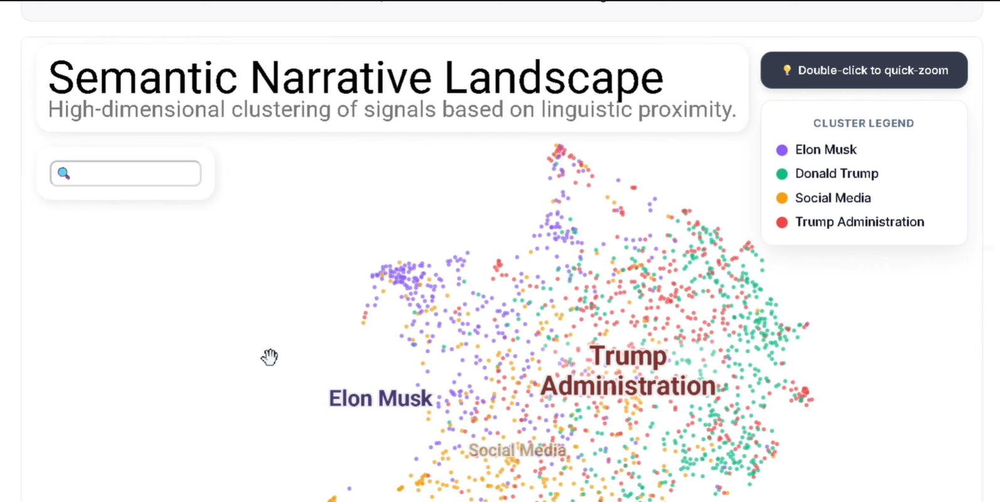
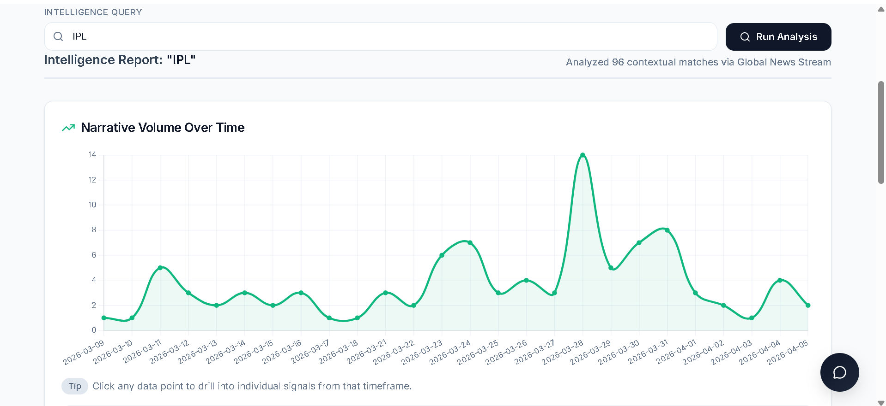
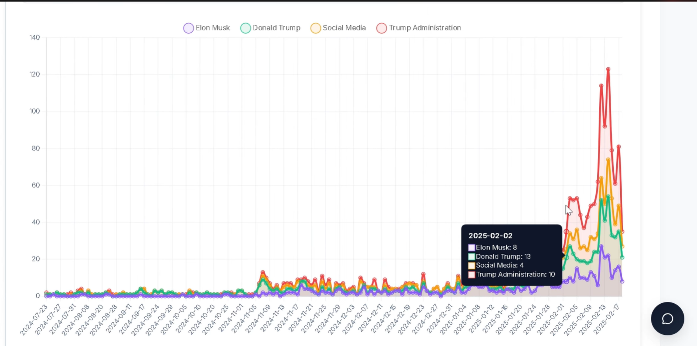
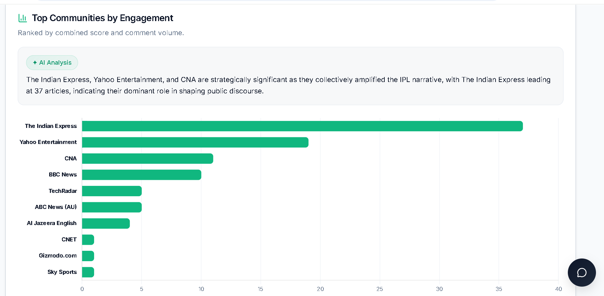

# 🌐 Narrative-Analyser: Investigative Intelligence Dashboard

[](https://research-engineering-intern-assignm-ten.vercel.app/) 
[](https://huggingface.co/spaces/d151617/narrative-intelligence-api/tree/main) 
[](https://youtu.be/j2MZIDp3elQ?si=u-VOcF97pkw6y-Gd) 

* **Demo:** https://research-engineering-intern-assignm-ten.vercel.app/ 
* **Video Demo:** https://www.youtube.com/watch?si=u-VOcF97pkw6y-Gd&v=j2MZIDp3elQ&feature=youtu.be

## Abstract
Narrative-Analyser is an end-to-end threat intelligence and digital narrative tracking platform. Moving beyond static keyword matching, this system leverages dense vector embeddings, bipartite network analysis, and Large Language Models to trace how information propagates across isolated social communities and global media syndicates. 

The architecture is highly modular and currently processes two distinct data streams:
1. **Reddit Archive:** Offline analysis of historical narrative patterns utilizing a FAISS vector database.
2. **Global News Analysis:** Real-time API integration fetching live global media articles, demonstrating the robustness of the ML pipeline against live, unstructured, and highly-syndicated data.

---

## 📸 Dashboard Previews



*Interactive UMAP projection mapping high-dimensional linguistic proximity of isolated narratives.*



*Time-series analysis tracking raw signal volume across the selected data stream.*



*Granular timeline segmenting narrative volume by dynamically generated AI topic clusters.*



*Engagement distribution across key communities and media portals, featuring dynamic GenAI-generated analytical summaries.*

---

## 🧠 System Capabilities & ML Architecture

### 1. High-Dimensional Clustering & Embedding Visualization
To understand the semantic landscape of a narrative, the system dynamically clusters incoming signals based on linguistic proximity.
* **Embedding Model:** `paraphrase-multilingual-MiniLM-L12-v2` (SentenceTransformers).
* **Topic Extraction:** TF-IDF (`max_features=50`, 2-3 ngrams) combined with Cosine Similarity against post embeddings for dynamic, human-readable cluster naming.
* **Dimensionality Reduction:** `UMAP` (`n_components=2`, `min_dist=0.1`, `n_neighbors` dynamically scaled).
* **Visualization:** `Datamapplot` (Interactive WebGL projection).
* **Engineering Note (Syndicated Density Handling):** When analyzing Global News API data, syndication causes dozens of identical articles to be returned. To prevent Kernel Density Estimators in UMAP/Datamapplot from throwing Singular Matrix crashes on perfectly overlapping data, the pipeline injects a **Float32 Micro-Noise Jitter** (`np.random.normal(0, 0.05)`) to safely separate identical vectors while preserving mathematical clustering integrity.

### 2. Network Analysis: Identifying Narrative Brokers
The system models the dataset as a **Bipartite Graph** to identify structural narrative brokers across communities.
* **Algorithm:** Bipartite Graph generation (Author ↔ Subreddit/Source) evaluated via **Betweenness Centrality** (`networkx.betweenness_centrality`).
* **Graph Pruning:** The pipeline aggressively prunes isolates and users who only post to a single community (degree < 2). This ensures the centrality algorithm strictly calculates the influence of *cross-community bridges*, rather than echo-chamber participants.
* **Visualization:** React Force-Graph-2D with D3 physics. Nodes are sized by their centrality score, automatically isolating the Top 50 structural spreaders of a narrative.

### 3. Deep Semantic Search
The system retrieves intelligence based on meaning, not exact string matches, utilizing L2 distance via a `faiss-cpu` `IndexFlatL2` database. 

**Zero-Keyword Overlap Examples:**
> **Query:** `"Digital currency regulations"`  
> **Retrieved Signal:** *"Stephen Miller says foreign fraud rings are setting up fake Social Security numbers... The news comes as Elon Musk's DOGE is now investigating the Social Security database."* > **Insight:** The model successfully maps "DOGE" and "Elon Musk" to the semantic vector space of cryptocurrency, retrieving this signal despite sharing zero exact vocabulary with the query.

> **Query:** `"Automated job replacement"`  
> **Retrieved Signal:** *"Trump administration directs agencies to fire recent hires en masse | Thousands of employees were already let go as of Thursday, a number that is expected to skyrocket in the coming days."* > **Insight:** The embedding model successfully maps the abstract concept of structural workforce displacement and systemic job loss to a major, real-world mass-firing event, retrieving the signal despite zero exact keyword overlap.

### 4. Contextual AI Agent & Dynamic Summaries
A contextual LLM agent acts as an intelligence co-pilot, generating human-readable insights dynamically based on the active data slice.
* **Model:** `deepseek/deepseek-chat` via LangChain (`ChatOpenAI` wrapper).
* **Memory Architecture:** To prevent `context_length_exceeded` crashes during deep investigations, the chatbot utilizes a **Sliding Window Memory** (retaining only the last 4 user interactions).
* **Features:** The agent provides strictly structured JSON responses, authoritative plain-text answers, and proactively suggests 2-3 related follow-up queries to guide the analyst's investigation.

---

## 🛠️ Local Setup & Deployment

### Backend (FastAPI + Python)
The backend is fully containerized via Docker and deployed on Hugging Face Spaces.

```bash
cd backend
python -m venv venv
source venv/bin/activate
pip install -r requirements.txt

# Create the FAISS index locally
python build_index.py

# Run the server
uvicorn main:app --reload

Frontend (React + Vite)
The frontend utilizes a custom "Slate & Emerald" Tailwind design system for an enterprise SaaS aesthetic and is deployed via Vercel.

#Environment Variables Required
#Create a .env file in the backend directory:

# AI Usage & Iteration Log
#All AI-assisted prompt iterations, debugging processes, and architectural decisions are documented sequentially in the root directory as part of transparent engineering practices:
